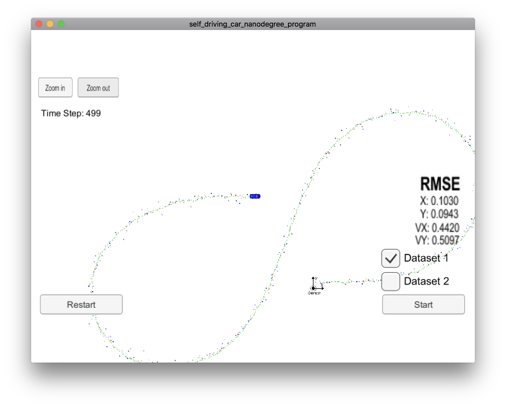
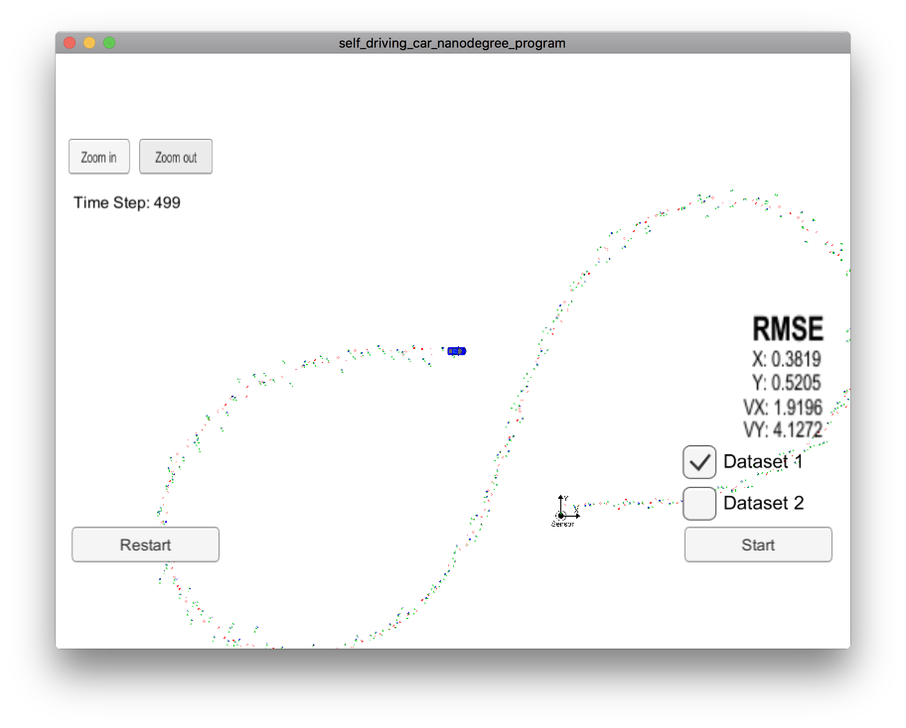
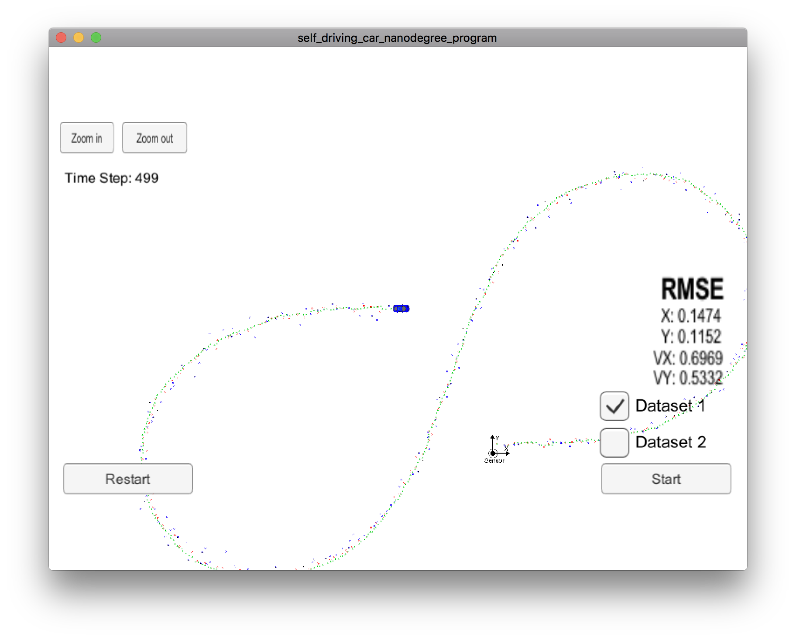

# Extended Kalman Filter Project 

Igor Passchier
igor.passchier@tassinternational.com

## Introduction
This is the submission of the Extended Kalman Filter Project. The following sections follow the project rubric of the project.

## Compiling
The code can be build and executed as follows:

1. mkdir build
2. cd build
3. cmake ..
4. make
5. ./ExtendedKF

To get this working on my mac, I had to change the change the version of libuv to 1.15.0, instead of 1.11. Maybe it is necessary to change this back if compiled on another platform: I have not been able to check this on other environments than my mac with the lastest version of macos, xcode command line tools, and os libraries installed with the brew.

## Accuracy

When run on the first data set in the simulator, the results of the RMSE are. [0.1030, 0.0943, 0.4420, 0.5097], which is better than the required maximum values of [.11, .11, 0.52, 0.52]. See screenshot below

## Follows the correct algoritmn
The code structure was already following the described structure of the preceeding lessons. Nothing has changed to the execution flow.

The algorithm handles the first measurement appropriately to set px and py. vx and vy cannot be determined, neither from the laser, nor from the radar. Therefore, those are left as 0. Initialization code can be found starting at line 80 of FusionEKF.cpp.

Prediction and update is done starting at line 122 and line 152, respectively, of FusionEKF.cpp. For the lidar data, a standard filter is used, while for the radar data the extended kalman filter is used. Code for both updates can be found in kalman_filter.cpp, startin gat line 46 and 68 respectively.

For the extended kalman filter, also h(x) for the radar is required. This is implemented in tools.cpp, line 74.                 

## Code Efficiency
The code has been written with a balance between readability and efficiency. E.g., in the prediction step (FusionEKF.cpp line 122), the various powers of dt are only calculated once, and used multiple times.

## Additions
I have made the code such, that it is possible to switch between using lidar, radar, or both with 2 (hardcoded) switches in FusionEKF.cpp line 74. Both the initialisation and the update steps are affected by this selection. I have ran the code with all three options to see the effect of the individual sensors and the fusion. Below are the screenshots of the 2 runs with only 1 sensor in use (the fused result is presented already above).

**Figure: Radar only simulation**

**Figure: Lidar only simulation**

From this, several things can be observed:

* The fused results are (as expected) significantly better than the single sensor solutions
* The lidar only results are significantly better than the radar only results. This even holds for the velocity. Apparantly, the lack of direct velocity measurement from the ladar is more than compensated by the more accurate position information and implicit differentation that takes place based on the position data.
* For the lidar only data, vy is more accurate than vx. This is probably due to the fact that the driving pattern is such that driving direction is predominantly in the x direction.
* For the radar only, the opposite can be observed: vx is much better than vy. This is due to the fact that rho dot is predominantly aligned with vx, so velocity sensitivity of the radar is better in diretion x than y.

